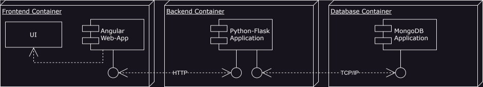

# EventManager - Containerized Application

This project is a web-based event management application that allows users to manage and participate in events. The application uses a **Flask backend**, an **Angular frontend**, and **MongoDB** as the database. The entire system is containerized using Docker to meet the module requirements for containerization, orchestration, and scalability.

## Table of Contents

- [EventManager - Containerized Application](#eventmanager---containerized-application)
  - [Table of Contents](#table-of-contents)
  - [Project Architecture](#project-architecture)
    - [Component Diagram](#component-diagram)
    - [Communication Between Components](#communication-between-components)
  - [Components Overview](#components-overview)
  - [Setup](#setup)
    - [Prerequisites](#prerequisites)
    - [Steps to Set Up the Application](#steps-to-set-up-the-application)
    - [docker-compose.yaml](#docker-composeyaml)
      - [1. Clone the Repository](#1-clone-the-repository)
      - [2. Build the Docker Images](#2-build-the-docker-images)
      - [3. Start the Containers](#3-start-the-containers)
      - [4. Verify the Setup](#4-verify-the-setup)
      - [5. Stopping the Containers](#5-stopping-the-containers)
  - [Docker Commands](#docker-commands)
    - [Build and Start Services](#build-and-start-services)
    - [Monitor Resource Usage](#monitor-resource-usage)
    - [Inspect Volumes](#inspect-volumes)
    - [Remove Volumes](#remove-volumes)
  - [Project Requirements and Docker Features](#project-requirements-and-docker-features)
    - [Images](#images)
    - [Network](#network)
    - [Volumes](#volumes)
    - [Resource Limitation](#resource-limitation)
    - [Security](#security)
    - [Setup for Scaling and Swarm Mode](#setup-for-scaling-and-swarm-mode)
      - [Swarm Initialization and Deployment](#swarm-initialization-and-deployment)
      - [Scaling the Backend](#scaling-the-backend)
      - [Monitoring Services](#monitoring-services)
      - [Networking in Swarm Mode](#networking-in-swarm-mode)
      - [Rolling Updates](#rolling-updates)
      - [Troubleshooting Swarm Mode](#troubleshooting-swarm-mode)
    - [Swarm Mode in `docker-compose.yaml`](#swarm-mode-in-docker-composeyaml)
    - [Docker Integration](#docker-integration)
    - [Minimum App Features](#minimum-app-features)

---

## Project Architecture

This application follows a **multi-container architecture** with the following components:

- **Frontend**: An Angular-based UI for interacting with the event management system.
- **Backend**: A Python Flask API that handles CRUD operations on events and connects to the MongoDB database.
- **Database**: MongoDB, a NoSQL database that stores the event data.

### Component Diagram



### Communication Between Components

- **Frontend** communicates with the **Backend** via HTTP requests to the Flask API.
- **Backend** interacts with **MongoDB** using the `pymongo` library to store and retrieve event data.

---

## Components Overview

- **Frontend (Angular)**: Provides an interactive GUI for users to create, read, update, and delete events.
- **Backend (Flask)**: Exposes a REST API for managing events and communicating with the MongoDB database.
- **Database (MongoDB)**: Stores event data.

---

## Setup

This chapter will guide you through the process of setting up and running the Docker images and containers for the EventManager project, which includes the Angular frontend, Flask backend, and MongoDB database. By the end of this setup, you will have a fully containerized application running on your local machine.

### Prerequisites

Before proceeding with the setup, make sure you have the following installed on your machine:

1. **Docker**: Ensure you have Docker installed. You can download it from [Docker's official website](https://www.docker.com/get-started).
2. **Docker Compose**: This is usually bundled with Docker Desktop. If not, follow [this link](https://docs.docker.com/compose/install/) to install Docker Compose.
3. **Git**: You'll need Git to clone the repository. Install it from [Git's official website](https://git-scm.com/).

### Steps to Set Up the Application

### docker-compose.yaml

The following yaml code depicts the base `docker-compose.yaml` file part of the github repository.

```yaml
version: '3.8'
services:
  frontend:
    build:
      context: ./frontend
      dockerfile: Dockerfile
    image: eventmanager/frontend:1.0
    container_name: eventmanager_frontend
    ports:
      - "4200:80"
    environment:
      - API_URL=http://backend:5000
    networks:
      - eventmanager_network
    depends_on:
      - backend

  backend:
    build:
      context: ./backend
      dockerfile: Dockerfile
    image: eventmanager/backend:1.0
    container_name: eventmanager_backend
    ports:
      - "5000:5000"
    environment:
      - MONGO_URI=mongodb://mongodb:27017/your_database_name
    networks:
      - eventmanager_network
    depends_on:
      - mongodb

  mongodb:
    build:
      context: ./mongodb
      dockerfile: Dockerfile
    container_name: eventmanager_mongodb
    ports:
      - "27017:27017"
    networks:
      - eventmanager_network
    volumes:
      - mongodb_data:/data/db
    environment:
      - MONGO_INITDB_DATABASE=your_database_name

networks:
  eventmanager_network:
    driver: bridge

volumes:
  mongodb_data:
    driver: local
```

#### 1. Clone the Repository

Start by cloning the EventManager project from your version control system:

```bash
git clone https://github.com/maknis3/eventmanager.git
cd eventmanager
```

This will download all necessary files, including the `docker-compose.yaml` file, backend, frontend, and any supporting documents.

#### 2. Build the Docker Images

To create the Docker images for the frontend, backend, and MongoDB, you will use Docker Compose. The provided `docker-compose.yaml` is preconfigured to build and run all the services. To build the images, run:

```bash
docker-compose build --no-cache
```

This command will:

- **Frontend**: Build the Angular application image from the `frontend/Dockerfile`.
- **Backend**: Build the Flask application image from the `backend/Dockerfile`.
- **MongoDB**: Build the MongoDB application image from the `mongodb/Dockerfile`.

#### 3. Start the Containers

Once the images are built, start the containers with:

```bash
docker-compose up -d
```

This command does the following:

- **Creates a custom network** (`eventmanager_network`) to allow communication between the containers.
- **Starts the MongoDB** container and maps its data directory to a volume for persistence.
- **Launches the Flask backend** on `http://localhost:5000`.
- **Starts the Angular frontend** on `http://localhost:4200`, mapping port 80 inside the container to port 4200 on your local machine.

#### 4. Verify the Setup

To verify that all services are running correctly, you can Check Container Status using:

```bash
docker-compose ps
```

#### 5. Stopping the Containers

To stop the containers gracefully:

```bash
docker-compose down
```

This command will stop and remove the running containers. However, it will **not remove the volumes**, so your MongoDB data will persist across sessions.

If you want to stop the containers and remove all resources, including volumes, use:

```bash
docker-compose down --volumes
```

---

## Docker Commands

### Build and Start Services

```bash
docker-compose up --build
```

This command builds all the necessary images (Frontend, Backend, MongoDB) and starts the services as specified in the `docker-compose.yaml` file.

This command will scale the **backend** service to run 3 instances.

### Monitor Resource Usage

```bash
docker stats
```

You can monitor the CPU, memory, and I/O usage of the running containers using this command.

### Inspect Volumes

```bash
docker volume inspect mongodb_data
```

Inspect the details of the MongoDB volume where the database is persisted.

### Remove Volumes

```bash
docker volume rm <volume_name>
```

This command allows you to remove unused Docker volumes to free up space.

---

## Project Requirements and Docker Features

This section explains how the project meets the course requirements.

### Images

- The application uses **three images**:
  - **Frontend (Angular)**: `eventmanager/frontend:1.0`
  - **Backend (Flask)**: `eventmanager/backend:1.0`
  - **MongoDB**: Uses the official MongoDB image `mongo:6.0`

- Each image is versioned (`1.0`) and can be tagged during build. For example:

    ```bash
    docker build -t eventmanager/backend:1.0 ./backend
    ```

### Network

- **Custom Network**: The `docker-compose.yaml` file creates a custom **bridge network** (`eventmanager_network`) to enable communication between the containers.
- **Port Forwarding**: The following ports are exposed:
  - **Frontend**: `4200 -> 80`
  - **Backend**: `5000 -> 5000`
  - **MongoDB**: `27017 -> 27017`

To view network details:

```bash
docker network inspect eventmanager_network
```

### Volumes

- **Volume Mounting**: MongoDB data is persisted in a Docker volume (`mongodb_data`).
- **Inspecting Volumes**:

    ```bash
    docker volume inspect mongodb_data
    ```

- **Removing Volumes**:

    ```bash
    docker volume rm mongodb_data
    ```

### Resource Limitation

The resources can be limited for each container. In the `docker-compose.yaml`, you can define CPU and memory limitations for services. Example:

```yaml
deploy:
  resources:
    limits:
      cpus: '0.5'
      memory: 512M
```

### Security

- **User for Container**: The backend container runs as a non-root user (`myuser`) for security purposes.
- **Vulnerability Scanning**: Use tools like `Trivy` to scan the images for vulnerabilities.

To scan an image:

```bash
trivy image eventmanager/backend:1.0
```

### Setup for Scaling and Swarm Mode

This section explains how to configure and deploy the **EventManager** application with Docker Swarm for scaling the backend.

#### Swarm Initialization and Deployment

1. **Initialize Docker Swarm**:

   First, you need to initialize Docker Swarm on your machine. This enables Docker's built-in orchestration features.

   Run the following command in your terminal:

   ```bash
   docker swarm init
   ```

   This initializes Docker Swarm and makes your current machine the **Swarm manager**.

2. **Deploy the Application Stack**:

   In Swarm mode, instead of using `docker-compose`, you use `docker stack deploy` to deploy your services.

   To deploy the application in Swarm mode, run the following command:

   ```bash
   docker stack deploy -c docker-compose.yaml eventmanager_stack
   ```

   This will create and deploy the services as defined in your `docker-compose.yaml` file but under Swarm management.

3. **Verify the Stack and Services**:

   You can verify that the services are running by listing the active stacks and services:

   ```bash
   docker stack ls  # Lists all active stacks

   docker stack services eventmanager_stack  # Lists services in the stack
   ```

   To check the running containers (tasks) for a specific service, use:

   ```bash
   docker service ps eventmanager_stack_backend  # Lists backend replicas
   ```

#### Scaling the Backend

With Docker Swarm, you can easily scale services. The `backend` service can be scaled up or down to handle more or fewer requests.

To scale the backend to 3 replicas:

```bash
docker service scale eventmanager_stack_backend=3
```

This command will deploy 3 replicas of the backend service, distributing requests evenly across the instances via Docker's internal load balancer.

#### Monitoring Services

To monitor the resource usage of the running services, use the following command:

```bash
docker stats
```

This will show the CPU, memory, and I/O usage of the containers in real time.

#### Networking in Swarm Mode

In Docker Swarm, all services are deployed on an **overlay network**. This network allows the services to communicate internally without exposing their ports directly to the host.

- The frontend service will use `http://backend:5000` to communicate with the backend.
- Docker Swarm automatically load-balances requests between the backend replicas.

#### Rolling Updates

Docker Swarm allows for rolling updates to your services. If you need to update the backend image (for example, deploying version `2.0`), you can do so with a rolling update.

1. **Update the `docker-compose.yaml` file** to reference the new image version:

   ```yaml
   image: eventmanager/backend:2.0
   ```

2. **Redeploy the stack** with the updated image:

   ```bash
   docker stack deploy -c docker-compose.yaml eventmanager_stack
   ```

Swarm will update the backend service incrementally, ensuring no downtime.

#### Troubleshooting Swarm Mode

- To inspect logs for a specific service, use:

  ```bash
  docker service logs eventmanager_stack_backend
  ```

  This command will show logs for all backend replicas, which helps in debugging issues during scale-out operations.

- If the stack needs to be removed or reset, you can remove the stack with:

  ```bash
  docker stack rm eventmanager_stack
  ```

---

### Swarm Mode in `docker-compose.yaml`

The following yaml code depicts the `docker-compose.yaml` file for working in Swarm mode:

```yaml
version: '3.8'

services:
  frontend:
    build:
      context: ./frontend
      dockerfile: Dockerfile
    image: eventmanager/frontend:1.0
    ports:
      - "4200:80"
    environment:
      - API_URL=http://backend:5000
    networks:
      - eventmanager_network
    depends_on:
      - backend

  backend:
    build:
      context: ./backend
      dockerfile: Dockerfile
    image: eventmanager/backend:1.0
    environment:
      - MONGO_URI=mongodb://mongodb:27017/your_database_name
    networks:
      - eventmanager_network
    depends_on:
      - mongodb
    deploy:
      replicas: 3
      update_config:
        parallelism: 2
        delay: 10s
      restart_policy:
        condition: on-failure
      resources:
        limits:
          cpus: '0.50'
          memory: 512M

  mongodb:
    image: mongo:latest
    container_name: eventmanager_mongodb
    ports:
      - "27017:27017"
    networks:
      - eventmanager_network
    volumes:
      - mongodb_data:/data/db
    environment:
      - MONGO_INITDB_DATABASE=your_database_name

networks:
  eventmanager_network:
    driver: overlay

volumes:
  mongodb_data:
    driver: local
```

### Docker Integration

- **Docker REST API with HTTPS**: To integrate Docker REST API securely with HTTPS, you would need to configure Docker Daemon with SSL certificates. You can follow the [Docker documentation](https://docs.docker.com/engine/security/https/) to set this up.

### Minimum App Features

- **CRUD Application**: The backend provides full CRUD functionality for managing events. The endpoints allow creating, reading, updating, and deleting events.
- **Web Framework (Angular)**: The frontend is built using Angular, providing a responsive and interactive GUI.
- **Content in Database**: MongoDB stores the event data and supports queries from the backend.
- **Interactive GUI**: Users can interact with the system via the Angular web interface to manage events.

---
